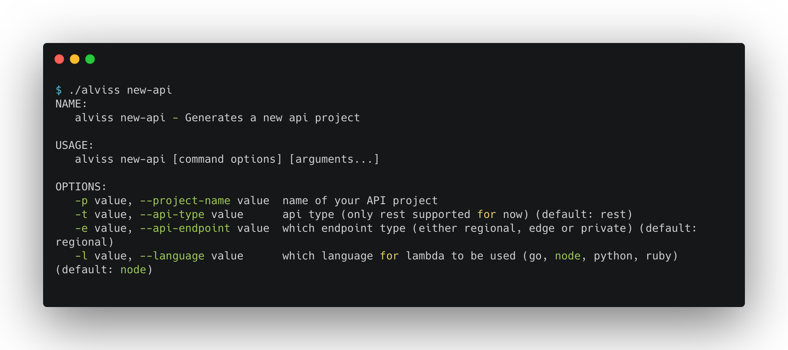

  
  
  
  

**Alviss** is a scaffolding project that let's you provision and deploy production ready serverless API:s in seconds on AWS using API Gateway and Lambda with your preferred programming language

Rationale
--------
Configuring API Gateway and Lambda using standard IaC tools like Terraform and Cloudformation is a very finicky, verbose and time consuming experience. Even with tools that are designed for serverless applications like *AWS SAM* and *serverless framework* can be hard and time consuming. Alviss is a scaffolder that takes care of generating the boilerplate using best practices and leaves you to tweak or modify the settings as you like. Use [AWS SAM](https://docs.aws.amazon.com/serverless-application-model/latest/developerguide/what-is-sam.html) to finally deploy the project.

Support for *serverless framework* is upcoming

Installation
--------
Alviss is built in Go; meaning no runtime or dependencies to install, just grab a pre-built binary from the [GitHub Releases page](https://github.com/rogerwelin/alviss/releases). You can optionally put the **alviss** binary in your `PATH` so you can run alviss from any location.

Usage
--------

Then just follow the instructions on the screen. It's that simple!

Demo
--------

Compliments
--------
Special thanks goes to [Axfood IT AB](https://www.axfood.se/) for letting me opensource this

